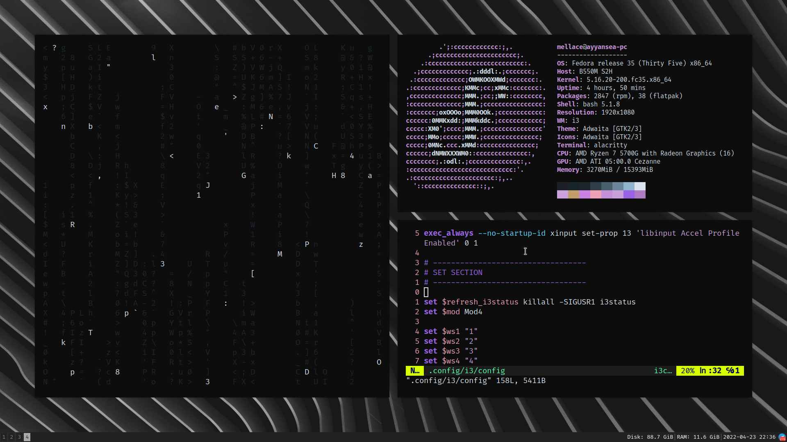

# My i3-gaps dotfiles.

This is a pretty simple setup (well, for now), as I really only want a basic workspace with no fancy stuff.

Dependencies:

* feh (for wallpapers)
* xclip, maim (for screenshots)
* xinput (to disable mouse acceleration)
* picom (the compositor)
* rofi (the app launcher)
* pactl (for changing system volume)
* alacritty (replaced urxvt with this terminal)
* vundle (vim plugins)

That's about it.
